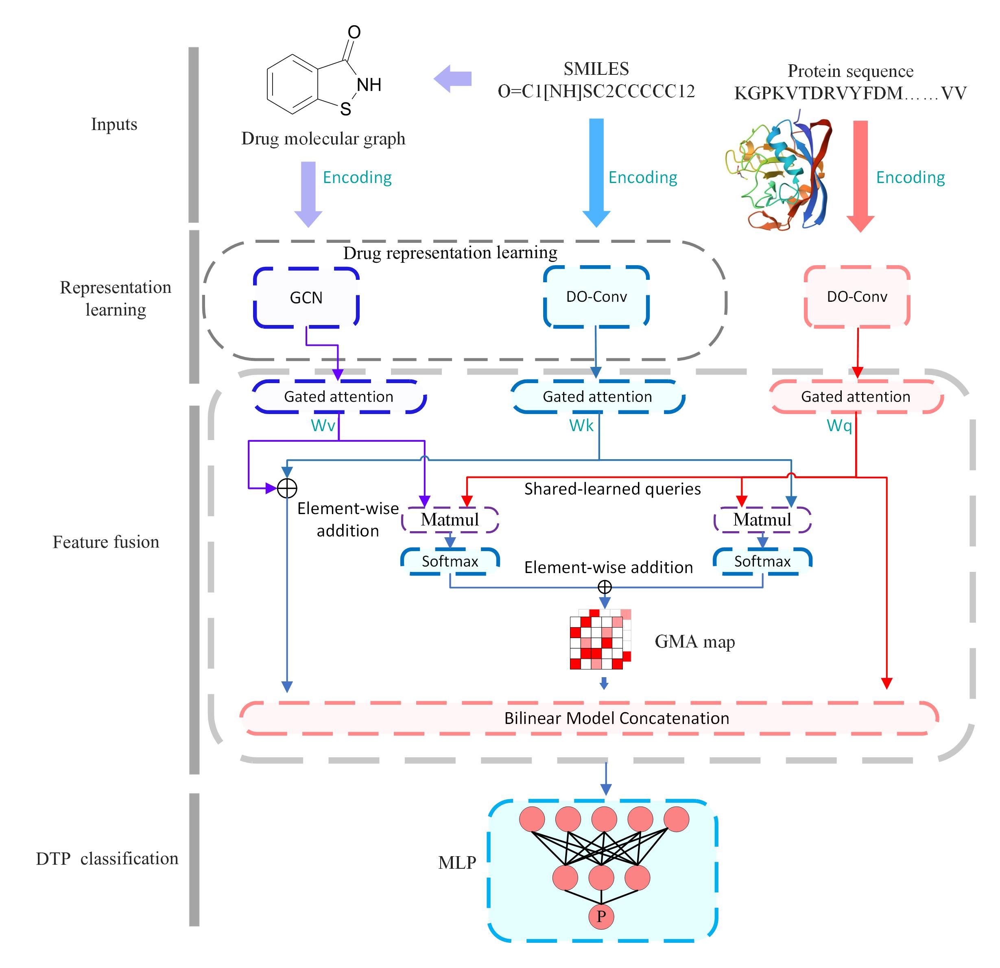

## DO-GMA: a depthwise over-parameterized convolutional network for drug-target interaction identification based on gated multi-head attention mechanisms

## Framework


## System Requirements
```
dgl==1.1.0+cu117
dgllife==0.3.2
einops==0.8.0
numpy==1.21.5
pandas==1.3.5
prettytable==3.11.0
scikit_learn==1.0.2
torch==1.13.1
yacs==0.1.8
```

## Using
main.py: start file for model training.

An example of the format in which we have loaded the data into the programme is at https://github.com/plhhnu/DO-GMA/tree/main/datasets. If you need to do a quick start, please run The file ‘main.py’ under https://github.com/plhhnu/DO-GMA/tree/main/code. 

You can get the detailed code implementation of GMA attention in 'attention.py', and the detailed code implementation of the whole framework in 'model.py'.

## Citation
Please cite our paper if you find our work useful in your own research.
```S

```
